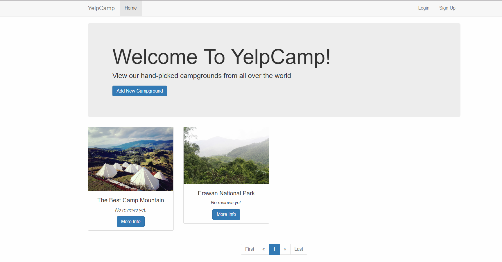

# YelpCamp - NodeJS Technology Web App Development 
## By The Web Developer Bootcamp.

    

My NodeJS Project from  - [Colt Steele's Udemy Web Development course.](https://www.udemy.com/the-web-developer-bootcamp/)

Click to see - [Live Website](https://protected-waters-30420.herokuapp.com/)

## Features
- Basic
    - Create, Edit, Delete and Comment
- Use GoogleMap API
- Authentication
    - User login or sign-up
    - Admin user
- Time since
- Ratings and reviews
- Pagination in campgrounds index

## Technology
- Bootstrap
- HTML
- CSS
- Javascript
- MongoDB
- NodeJS
    - EJS
    - mongoose
    - express
    - method override
    - body-parser
    - connect-flash
    - passport
    - express-sanitizer
    - moment
    - node-geocoder
    - etc.
    
## Platform as a service
 - Heroku
 - mLab
 
## License - [MIT](./LICENSE)
